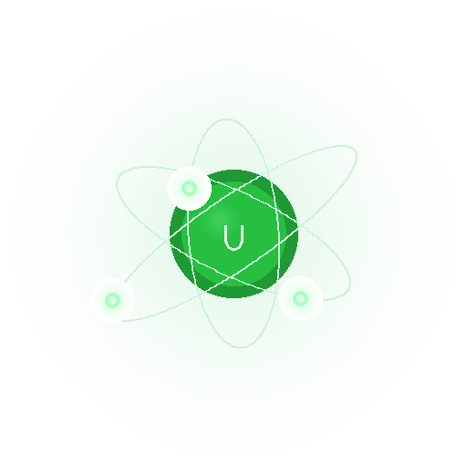

<p align="center">
  
</p>

<h1 align="center">Atom</h1>

<p align="center">
  <em>A beautiful, physically-accurate simulation of uranium-235 fission chain reactions.</em><br/>
  Built with <a href="https://love2d.org/">LÖVE2D</a> and Lua. Zero external assets — every pixel is procedurally generated.
</p>

<p align="center">
  
  
</p>

---

> *"How do I boil water?"*
> — every nuclear engineer, when someone asks what they do for a living

## ✨ What is this?

**Atom** lets you play reactor operator. Click inside the reactor vessel to fire
thermal neutrons at U-235 atoms and watch the chain reaction unfold. Manage
control rods, keep an eye on core temperature, and try not to melt down. ☢️

The simulation models real nuclear physics — neutron energy spectra, cross-section
probabilities, moderator thermalization, Doppler broadening, delayed neutrons,
and more — all wrapped in a gorgeous, glowing visual package.

## 🚀 Getting Started

### Install LÖVE

Grab [LÖVE2D](https://love2d.org/) 11.x for your platform:

| Platform | Install |
|----------|---------|
| **macOS** | `brew install love` |
| **Ubuntu/Debian** | `sudo apt install love` |
| **Arch** | `sudo pacman -S love` |
| **Windows** | [Download from love2d.org](https://love2d.org/) |

### Run it

```bash
git clone <this-repo> && cd atom
love .
```

Or grab the latest `atom.love` from the [Actions](../../actions) tab and run it directly:
```bash
love atom.love
```

## 🎮 Controls

| Key | Action |
|-----|--------|
| **Click** | Fire a neutron into the reactor |
| **A** | Add more U-235 fuel |
| **C** | Toggle control rods in/out |
| **↑ / ↓** | Fine-tune control rod insertion (±10%) |
| **+ / −** | Speed up / slow down simulation |
| **Space** | Pause |
| **R** | Reset reactor |

## ⚛️ Physics Model

This isn't just a pretty animation — the neutron interactions are modeled after
real U-235 fission physics:

| Concept | How it works |
|---------|-------------|
| **Neutron energy** | Fission neutrons are born fast (~2 MeV). They lose energy over time as they scatter through the water moderator, eventually reaching thermal energies (~0.025 eV) where fission cross-sections are highest. |
| **Cross-sections** | Interaction probability follows real σ(E) trends — thermal neutrons are ~300× more likely to interact than fast neutrons. Each collision can result in **fission**, **elastic scatter**, or **radiative capture**. |
| **Doppler broadening** | As core temperature rises, resonance absorption increases, reducing the effective fission rate. This is the **negative temperature coefficient** that makes real reactors self-regulating. |
| **Delayed neutrons** | ~0.65% of fission neutrons (β_eff) are delayed, emerging 0.2–12 seconds after fission from daughter nuclei decay. These are what make real reactors controllable! |
| **Control rods** | Absorb neutrons on contact, reducing the neutron population and suppressing the chain reaction. |

## 🏗️ Project Structure

```
atom/
├── main.lua   — All simulation logic, physics, rendering, and UI
├── conf.lua   — LÖVE window & engine configuration
├── flux.lua   — Tweening library (vendored, by rxi)
├── logo.png   — Project logo
└── AGENTS.md  — Developer reference & coding conventions
```

## 💚 Credits

Made with **<3** by **vinny**.

Tweening powered by [flux](https://github.com/rxi/flux) by rxi (MIT license).
